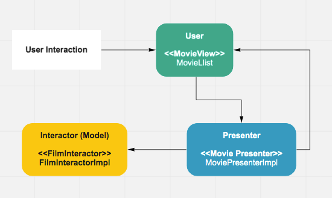

# Desafio PetLove Android:

<p align="center">
  
</p>
<a name="flow" />

1. [Introdução](#introduction) 
2. [Requisitos](#requirements) 
3. [Arquitetura](#architecture)
4. [Recursos](#resources)
5. [Considerações](#considerations)
5. [Instalação](#setup)  
6. [Licença](#license)
<a name="introduction" />

## Introdução

Desafio proposto pela empresa de e-commerce PetLove para a vaga de desenvolvedor Android. De acordo com o teste, você deve fazer um aplicativo livre, que lista os filmes populares do site TheMovieDB. No fluxo do aplicativo, o usuário pode abrir o filme e encontrar mais detalhes do mesmo.
<a name="requirements" />

## Requisitos:

1. Criar uma tela principal que lista os filmes populares do site TheMovieDB.
2. Na tela principal, carregar os dados vindos da API do TheMOvieDB em uma lista. Os itens a serem mostrados são: poster do filme, nome, avaliação do filme e data de lançamento.
3. Em cada item do filme, possui uma tela de detalhe. Onde devem ser mostrados as informações: capa do filme, nome, avaliação, data de lançamento, autor e direção.
4. Na tela principal, o usuário poderá atualizar a lista a qualquer momento.
5. A avaliação será feita a partir dos seguintes pontos: qualidade do código, projeto e arquitetura, testes, automação e escalabilidade.
8. O fluxo das telas está no topo e arquivo [Gif](https://github.com/rickaleu/petlove-android-challenge/blob/master/images/app.gif)app.gif.
<a name="architecture" />

## Arquitetura

A arquitetura utilizada foi a MVP (Model View Presenter). Em cada um dos packages próprios, contém uma interface e uma classe que implementa a interface.

<p align="center">
  
</p>

Foi feito também um desacoplamento das classes Response e Domain. Assim que a classe ResponseFilm recebe os dados vindos do JSON, ela já passa esses dados para a classe domain Film. Assim, quando a classe de detalhe do filme puxa as informações, ela já recebe o objeto completo de Film serializado.

As demais classes, estão organizadas em seus respectivos packages.
<a name="resources" />

## Recursos

 1. **MVP**, como arquitetura principal;
 2. **Java**, como linguagem de programação;
 3. **Retrofit**, para requisições HTTP;
 4. **SerializedName**, para contornar as inconsistências de um dos JSONs;
 5. **Serializable**, para enviar o objeto completo para a classe de detalhe;
 6. **Picasso**, para o carregamento das imagens
 7. **Junit e Mockito**, para testes unitários.
 8. **Expresso**, para testes de tela.
<a name="considerations" />

## Considerações

No endpoint princial GET .movie/popular, eu não encontrei 2 dados pedidos nos requisitos: autor e direção. Para compensar estes dois campos, eu peguei outras informações: língua e sinopse, para complementar melhor as informações na tela de detalhe.
<a name="setup" />

## Instalação

Para rodar esse projeto utilize uma das seguintes formas:

Instale o APK disponível na raíz do projeto (app-desafio-petlove.apk)

ou

Clone o repositório na sua máquina.
Faça o build da aplicação utilizando Android Studio ou via terminal com ```./gradlew assembleDebug```
<a name="license" />

## Licença
<aside class="notice">
  
Copyright 2019 Ricardo Sousa

Licensed under the Apache License, Version 2.0 (the "License");
you may not use this file except in compliance with the License.
You may obtain a copy of the License at

    http://www.apache.org/licenses/LICENSE-2.0

Unless required by applicable law or agreed to in writing, software
distributed under the License is distributed on an "AS IS" BASIS,
WITHOUT WARRANTIES OR CONDITIONS OF ANY KIND, either express or implied.
See the License for the specific language governing permissions and
limitations under the License.

</aside>
